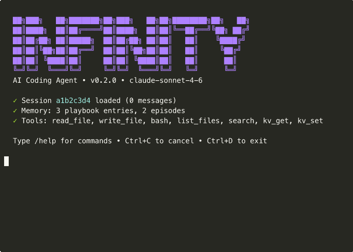

# InfinityCode

**An AI coding agent that builds software for you** — with rich terminal UX, durable memory, and a built-in analytics dashboard.

<p align="center">
  
</p>

> *Watch infinity-agent build a TaskFlow web app from a single prompt — with live progress, code block rendering, diff coloring, and tool execution tracking.*

---

## What is this?

InfinityCode is a Rust workspace that ships:

| Binary | Description |
|--------|-------------|
| **`infinity-agent`** | Interactive AI coding agent CLI (your own Claude Code) |
| **`infinity`** | AgentFS CLI — durable SQLite filesystem, KV store, audit log |
| **`agentfs-mcp`** | MCP JSON-RPC server over stdio |

The agent uses Claude as its brain, AgentFS as its memory, and gives you a terminal experience with:

- **Live progress indicators** — elapsed-time spinners, context-aware messages, no "stuck" moments
- **Rich code rendering** — bordered code blocks with syntax highlighting and diff coloring
- **Tool execution tracking** — per-tool colors, `[1/3]` progress, file paths in spinners, duration
- **Graceful Ctrl+C** — cancel current operation without killing the shell
- **Persistent memory** — playbook strategies, episode history, tool patterns across sessions
- **Analytics dashboard** — 3-view SPA with session deep-dive, agent brain, and cost tracking

## Quick Start

### 1. Install

**From GitHub releases (recommended):**

```bash
# Download from latest release
curl -L https://github.com/allthingssecurity/infinitycode/releases/latest/download/infinity-agent -o infinity-agent
chmod +x infinity-agent
mv infinity-agent /usr/local/bin/

# macOS: remove quarantine if needed
xattr -d com.apple.quarantine /usr/local/bin/infinity-agent
```

**From source:**

```bash
git clone https://github.com/allthingssecurity/infinitycode.git
cd infinitycode
cargo build --release --workspace
install -m 755 target/release/infinity-agent /usr/local/bin/
```

### 2. Authenticate

```bash
# Option A: OAuth login (opens browser)
infinity-agent login

# Option B: API key
export ANTHROPIC_API_KEY=sk-ant-...
```

### 3. Start coding

```bash
# Interactive chat with a project database
infinity-agent chat --db my-project.db

# One-shot prompt
infinity-agent chat --db my-project.db -p "add error handling to src/api.rs"

# Resume a previous session
infinity-agent chat --db my-project.db --session abc123

# Open the analytics dashboard
infinity-agent dashboard --db my-project.db
```

## CLI Experience

### Live Progress — Never Feels Stuck

```
  ⠹ Thinking (2.4s)                    # Color-cycling spinner with elapsed time
  ⠧ Reviewing results (1.2s)           # Context-aware follow-up messages
  ⠼ Preparing actions (0.8s)           # Fills dead zone before tool execution
  ↻ continuing (step 3)                # Shows agentic loop progression
```

### Rich Code Blocks with Diff Coloring

```
  ┌─ rust
  │  fn handle_request(req: Request) -> Response {
  │+     let auth = validate_token(&req)?;        ← green (added)
  │-     let data = req.body();                    ← red (removed)
  │+     let data = auth.parse_body(&req)?;        ← green (added)
  │      Response::ok(data)
  │  }
  └─
```

### Tool Progress Tracking

```
  ▸ [1/3] read_file  src/main.rs               # Per-tool colors + file paths
    ⠹ Reading src/main.rs (0.3s)               # Contextual spinner
    ✓ 0.3s                                      # Green checkmark + duration

  ▸ [2/3] bash  cargo test                      # Yellow for shell commands
    ⠹ Running cargo test (4.2s)
    ✗ 4.2s                                      # Red on failure

  ▸ [3/3] write_file  src/main.rs               # Green for writes
    ✓ 0.1s
```

### Token Usage & Cost

```
  tokens: 12.4k in · 3.8k out · cost: $0.024 · session: 31.2k ($0.044)
```

### Graceful Ctrl+C

- **Ctrl+C during generation** — cancels the current operation, rolls back partial messages
- **Ctrl+C at prompt** — clears the line (does NOT exit)
- **Ctrl+D** — exits the shell

## Analytics Dashboard

Start the dashboard server:

```bash
infinity-agent dashboard --db my-project.db
# → Dashboard at http://localhost:3457
```

### Three views:

**Overview** — KPI cards, token/cost charts, session table with clickable rows

**Session Detail** — Event timeline, tool calls with expandable input/output, token breakdown, learnings from the session

**Agent Brain** — Browse the agent's memory:
- **Playbook** — strategies and mistakes sorted by score
- **Episodes** — session summaries with key decisions and outcomes
- **Tool Patterns** — per-tool tips and common errors
- **Search** — full-text search across all memory

## AgentFS CLI

The `infinity` binary provides direct access to the durable storage layer:

```bash
# Initialize a database
infinity init ./project.db

# Filesystem operations
infinity fs mkdir ./project.db /src
infinity fs write ./project.db /src/main.rs "fn main() {}"
infinity fs ls ./project.db /
infinity fs cat ./project.db /src/main.rs

# Key-value store
infinity kv set ./project.db config.model claude-sonnet-4-6
infinity kv get ./project.db config.model

# Audit & analytics
infinity info ./project.db
infinity timeline ./project.db --limit 50
infinity sessions list ./project.db
infinity analytics cost ./project.db
```

## MCP Server

The `agentfs-mcp` binary runs as an MCP (Model Context Protocol) server over stdio:

```bash
agentfs-mcp
```

This lets any MCP-compatible client (Claude Desktop, etc.) use AgentFS as a tool provider.

## Architecture

```
┌─────────────────────────────────────────────┐
│              infinity-agent                  │
│  ┌─────┐ ┌──────────┐ ┌──────────────────┐  │
│  │REPL │→│ Agent    │→│ AnthropicClient  │  │
│  │     │ │ Loop     │ │ (streaming SSE)  │  │
│  └─────┘ └────┬─────┘ └──────────────────┘  │
│               │                              │
│         ┌─────▼──────┐                       │
│         │ToolExecutor│ → bash, read, write,  │
│         │            │   search, kv, list    │
│         └─────┬──────┘                       │
│               │                              │
│         ┌─────▼──────┐  ┌──────────────┐     │
│         │MemoryMgr   │  │ Dashboard    │     │
│         │(reflect)   │  │ (axum SPA)   │     │
│         └─────┬──────┘  └──────┬───────┘     │
│               │                │             │
├───────────────┼────────────────┼─────────────┤
│               ▼                ▼             │
│            agentfs-core                      │
│  ┌────────┐ ┌────┐ ┌──────┐ ┌──────────┐    │
│  │   FS   │ │ KV │ │Events│ │Analytics │    │
│  │(files) │ │    │ │(log) │ │(tokens)  │    │
│  └───┬────┘ └──┬─┘ └──┬───┘ └────┬─────┘    │
│      └─────────┴──────┴──────────┘           │
│                SQLite                        │
└─────────────────────────────────────────────┘
```

## Building & Releasing

```bash
# Build all binaries
cargo build --release --workspace

# Create a GitHub release
VERSION=v0.2.0
gh release create "$VERSION" \
  target/release/infinity-agent \
  target/release/agentfs-mcp \
  --title "InfinityCode $VERSION" \
  --notes "Release notes here"
```

## License

MIT
